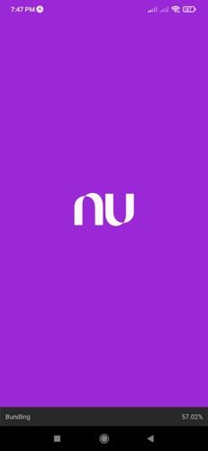
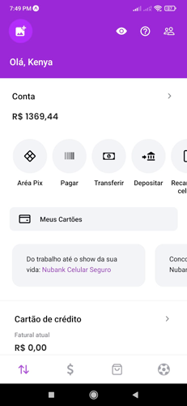
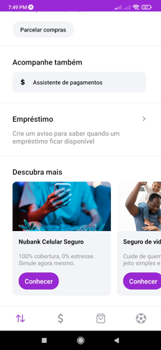
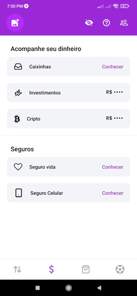
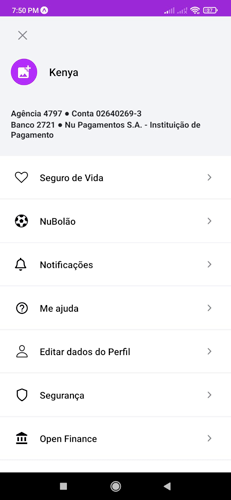
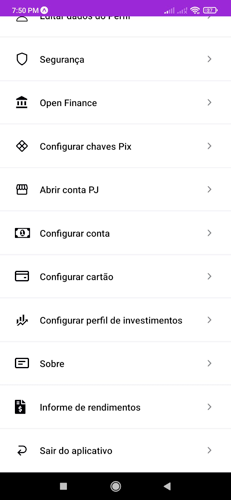

# Clone Nubank

## Sobre o projeto

O projeto foi desenvolvido em React Native com a ferramento Expo para fins de aprendizado e consiste em um aplicativo clonando a interface do aplicativo da nubank, devido a modificações na interface e funcionamentos do aplicativo original não fui capaz de terminar o projeto, mas ainda consegui realizar o desenvolvimento de algumas telas e funcionalidades. 

## Telas

As telas que estive desenvolvendo nesse projeto:

- **Página de carregamento do app**



- **Tela inicial - Parte 1**



- **Tela inicial - Parte 2**




- **Tela de investimento**



- **Tela de configurações - Parte 1**



- **Tela de configurações - Parte 2**



## Como iniciar

- clone o repositório com o seguinte comando:

    ```git
    git clone https://github.com/Lucasm4sco/clone-app-nubank.git
    ```

- Navegue até a pasta do projeto via terminal e execute:

    ```node
    npm install
    ```

- O comando acima irá instalar as dependências necessárias do código, assim que as dependências forem instaladas você pode iniciar o projeto com os comandos ```npm start``` ou ```npx expo start``` no terminal;

- Após isso será gerado um QRcode que você poderá usar pra acessar o aplicativo através de um emulador ou pelo aplicativo Expo go disponível na Play Store.

<p align="center">
    Desenvolvido com :heart: por <a href="https://github.com/Lucasm4sco">Lucasm4sco</a>
</p>